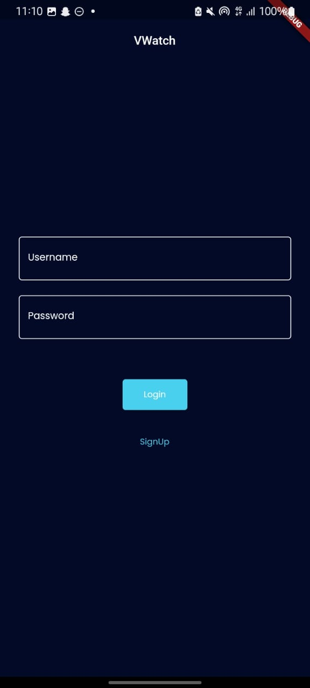
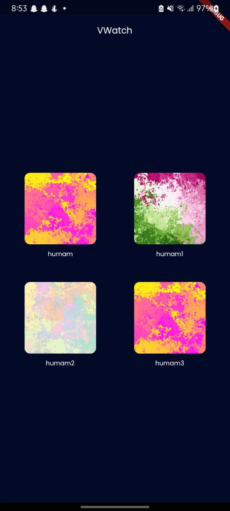
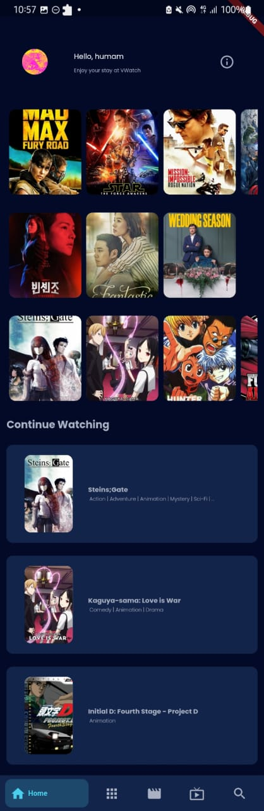
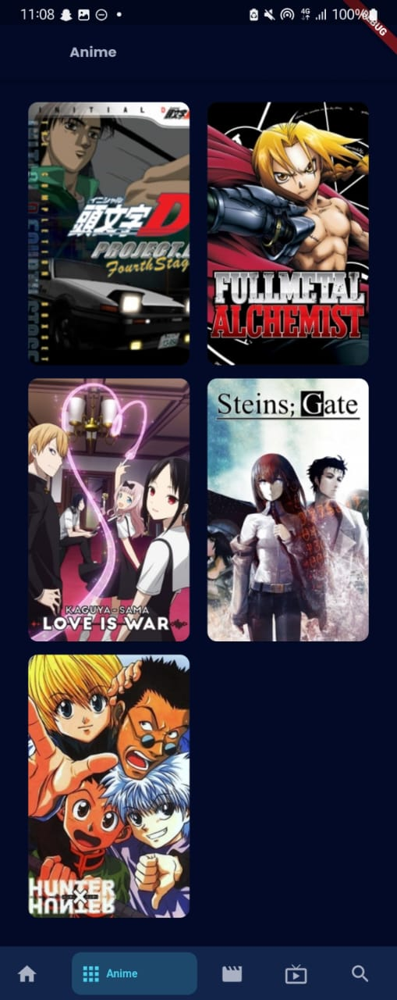
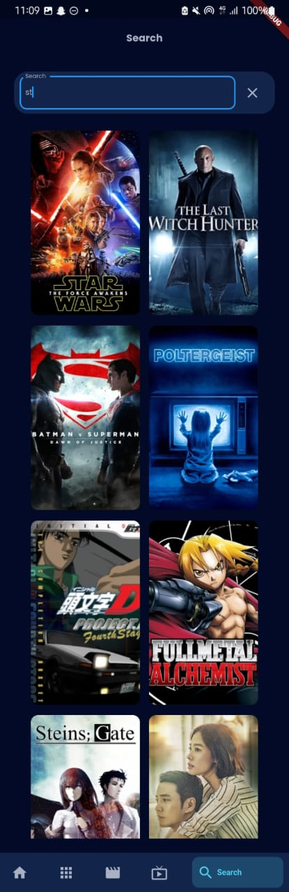
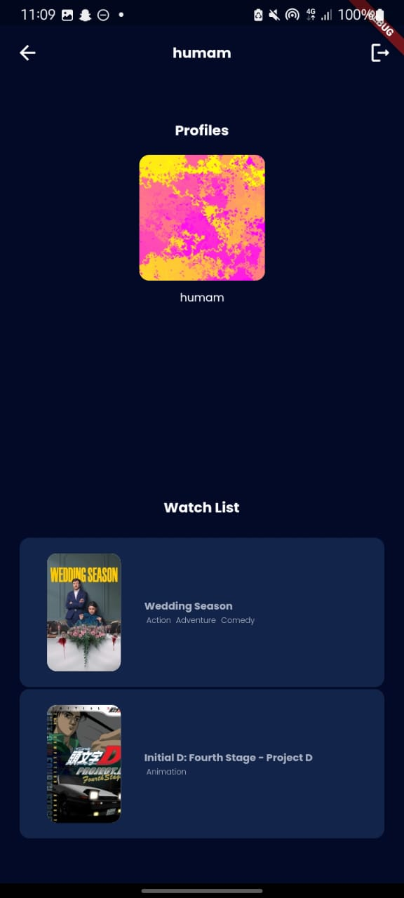
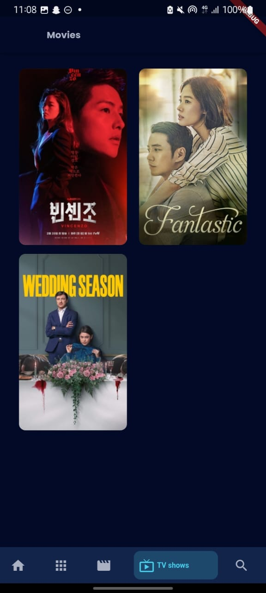
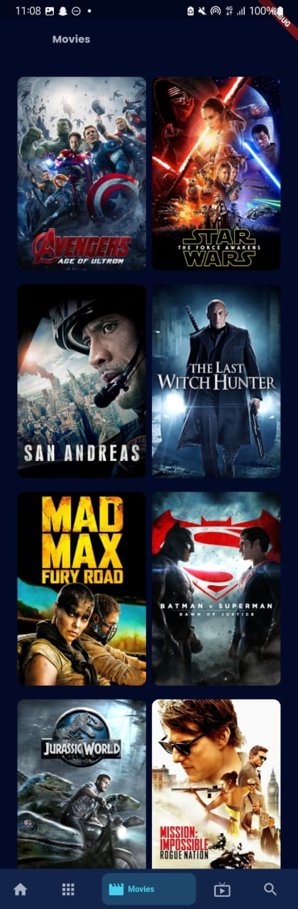

[![Contributors][contributors-shield]][contributors-url]
[![Forks][forks-shield]][forks-url]
[![Stargazers][stars-shield]][stars-url]
[![Issues][issues-shield]][issues-url]
[![MIT License][license-shield]][license-url]
[![LinkedIn][linkedin-shield]][linkedin-url]

<!-- PROJECT LOGO -->
 

  

  <h3 align="center">VWatch The Ultimate VOD app</h3>

  

     
    <a href="https://github.com/humamchoudhary/Vwatch"><strong>Explore the docs »</strong></a>
     
     
    <a href="https://github.com/humamchoudhary/Vwatch">View Demo</a>
    ·
    <a href="https://github.com/humamchoudhary/Vwatch/issues">Report Bug</a>
    ·
    <a href="https://github.com/humamchoudhary/Vwatch/issues">Request Feature</a>
  

# VWatch

V-watch is a Video on demand app, it is created using Flutter, Python (Flask), and JSON database.
The aim is to create a beautiful looking mobile app on which the user can have break free experience while watching their favorite movie or TV show.
V-Watch is a video on demand (VOD) streaming app that allows users to access a wide variety of movies, television shows, and other video content on their devices. With V-Watch, users can browse and search for content, create and save playlists, and stream videos in high definition.

# Explaination

## Back End

We are using Python, Json and Flask in our backend, each component is being used for following specific purposes:

### 1. Python:

We are using python for implementing Data Structures and Algorithms (DSA). Other than DSA we are also using python for main.py, singup.py,
login.py and exceptions.py.

- Queues.
- Stacks.
- Trees.
- Linked lists.

#### - Queues:

We are implementing a watchlist using queues. The principle on which queue works is First In, First Out (FIFO). Queue is being used to create a personalized watch list for the user where the user adds what they want to watch.

#### - Stacks:

Stacks works on the principle of First In, Last Out (FILO). We implemented watch history using stacks. Stacks are used to store the most recently watched items, with the most recent item being added to the top of the stack and the oldest item being removed from the bottom.

#### - Trees:

A tree is a non-linear hierarchical data structure that consists of nodes connected by edges. Using a binary search tree, we implemented a recommendation system based on their rating and tell the user what the currently top-ranking movies/TV shows are. Using simple trees, we have implemented a system in which a single user can create multiple profiles for different family members, and everyone can watch their movies separately without disturbing others watch histories and recommendations. Using simple tree, we have divided movies and tv shows into their categories based upon their genres.

#### - Linked lists:

Linked list is being used for TV shows and Anime management. It will keep track of the order in which episodes should be played. Since a linked list is a linear data structure, it is well-suited for storing a series of items in a specific order. In this case, the episodes in the linked list could be stored in the order in which they should be played, allowing the app to easily move to the next episode in the list when one finishes. To store metadata about each episode, such as whether it has been watched by the user or not. This information could be stored as additional fields in each node of the linked list, allowing the app to keep track of the user's progress through a particular TV show or movie.

### 2. Json:

JSON stands for JavaScript Object Notation. JSON is a lightweight format for storing and transporting data. We are using JSON for database. Data such as movies, anime, tv shows and user data is being stored in our project using JSON. Our whole data is capsuled in database.json.

- User_data.
- Movies_data.
- Anime_data.
- Show_data.

### 3. Flask:

Flask is an API. API stands for Application Programming Interface, which is a set of definitions and protocols for building and integrating application software. In our project, it serves as an interface between python and flutter. Post and Get commands are used to send and receive data from our server. The data received by the POST method is not cached by the server.
Other commands such as:

- jsonify (converts any given dictionary into json)
- make_response (in a single response we can add multiple header)
- request (allows us to retrieve URL arguments)

## Front End

We have made our front-end using flutter. As flutter is a robust mobile app development framework that can be used to create cross-platform apps for iOS, Android, and Windows. It uses Google's Dart programming language, and it comes with its own graphics library and material design, allowing faster app development and a more polished finished product. Basically, flutter is widget on widget keeping that concept in our mind we have made our GUI. Different concepts of flutter are used such as stateful widget, different containers are used, buttons etc.

## Demo Images

 
 

 
 

 
 

 
 

 
 

 
 

 
 

 
 

 
 

<!-- CONTACT -->

## Contact

Muhammad Humam Choudhary - [@humam_cho](https://twitter.com/humam_cho) - humamchoudhary@gmail.com

Project Link: [https://github.com/humamchoudhary/Vwatch](https://github.com/humamchoudhary/Vwatch/)

(<a href="#top">back to top</a>)

## License

[MIT](https://choosealicense.com/licenses/mit/)

<!-- MARKDOWN LINKS & IMAGES -->
<!-- https://www.markdownguide.org/basic-syntax/#reference-style-links -->

[contributors-shield]: https://img.shields.io/github/contributors/humamchoudhary/Vwatch.svg?style=for-the-badge
[contributors-url]: https://github.com/humamchoudhary/Vwatch//graphs/contributors
[forks-shield]: https://img.shields.io/github/forks/humamchoudhary/Vwatch.svg?style=for-the-badge
[forks-url]: https://github.com//humamchoudhary/Vwatch/network/members
[stars-shield]: https://img.shields.io/github/stars/humamchoudhary/Vwatch.svg?style=for-the-badge
[stars-url]: https://github.com/humamchoudhary/Vwatch/stargazers
[issues-shield]: https://img.shields.io/github/issues/humamchoudhary/Vwatch.svg?style=for-the-badge
[issues-url]: https://github.com/humamchoudhary/Vwatch/issues
[license-shield]: https://img.shields.io/github/license/humamchoudhary/Vwatch.svg?style=for-the-badge
[license-url]: https://github.com/humamchoudhary/Vwatch/blob/master/LICENSE.txt
[linkedin-shield]: https://img.shields.io/badge/-LinkedIn-black.svg?style=for-the-badge&logo=linkedin&colorB=555
[linkedin-url]: https://linkedin.com/in/humam-choudhary-362278228/
